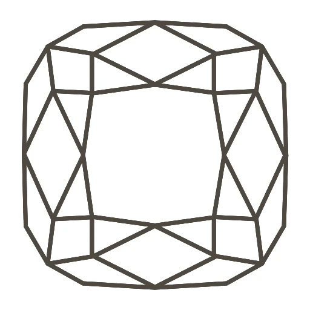

<a id="readme-top"></a>

<!-- PROJECT LOGO -->
<br />
<div align="center">
  <a href="https://ivanaogrizovic.github.io/thepinkpanther/">
    
  </a>

<h3 align="center">The Pink Panther</h3>

  <p align="center">
    The Pink Panther is a make believe jewelry store front. It was created for learning purposes
    <br />
    <br />
    
    <br />
    <a href="https://github.com/ivanaogrizovic/thepinkpanther">View Demo</a>
    <!-- &middot;
    <a href="https://github.com/ivanaogrizovic/thepinkpanther/issues/new?labels=bug&template=bug-report---.md">Report Bug</a>
    &middot;
    <a href="https://github.com/ivanaogrizovic/thepinkpanther/issues/new?labels=enhancement&template=feature-request---.md">Request Feature</a> -->
  </p>
</div>

<!-- TABLE OF CONTENTS -->
<details>
  <summary>Table of Contents</summary>
  <ol>
    <li>
      <a href="#about-the-project">About The Project</a>
      <ul>
        <li><a href="#built-with">Built With</a></li>
      </ul>
    </li>
    <li>
      <a href="#getting-started">Getting Started</a>
      <ul>
        <li><a href="#installation">Installation</a></li>
      </ul>
    </li>
    <li><a href="#roadmap">Roadmap</a></li>
    <li><a href="#contributing">Contributing</a></li>
    <li><a href="#license">License</a></li>
    <li><a href="#contact">Contact</a></li>
  </ol>
</details>

<!-- ABOUT THE PROJECT -->

## About The Project

🚨Refactor in progress🚨

The Pink Panther is a make believe jewelry store front.
It was created for learning purposes.<br>Here are some features:

- React, TypeScript, and SCSS based
- Mobile-first design
- Fully responsive
- Made with reusable components
- Every page is fully accessible (WCAG 2.2 AA)

<p align="right">(<a href="#readme-top">back to top</a>)</p>

### Built With

- 
- 
- 
- 

<p align="right">(<a href="#readme-top">back to top</a>)</p>

<!-- GETTING STARTED -->

## Getting Started

To get a local copy up and running follow these simple example steps.

### Installation

1. Clone the repo
   ```sh
   git clone https://github.com/ivanaogrizovic/thepinkpanther.git
   ```
2. Install NPM packages
   ```sh
   npm install
   ```
3. In your terminal, run the repo
   ```js
   npm run start
   ```

<p align="right">(<a href="#readme-top">back to top</a>)</p>

<!-- ROADMAP -->

## Roadmap

- Cart functionality
- Framer Motion intergration for more interesting animations
- Adding tests, using Jest and Cypress
- Custom backend with ExpressJS to allow log in

<p align="right">(<a href="#readme-top">back to top</a>)</p>

<!-- CONTRIBUTING -->

## Contributing

Contributions are what make the open source community such an amazing place to learn, inspire, and create. Any contributions you make are **greatly appreciated**.

If you have a suggestion that would make this better, please fork the repo and create a pull request. You can also simply open an issue with the tag "enhancement".
Don't forget to give the project a star! Thanks again!

1. Fork the Project
2. Create your Feature Branch (`git checkout -b feature/AmazingFeature`)
3. Commit your Changes (`git commit -m 'Add some AmazingFeature'`)
4. Push to the Branch (`git push origin feature/AmazingFeature`)
5. Open a Pull Request

<p align="right">(<a href="#readme-top">back to top</a>)</p>

<!-- LICENSE -->

## License

Do not copy or claim as your own.<br>I do not own the rights to the images used in this project as it was made for learning purposes and not for commercial purposes.

<p align="right">(<a href="#readme-top">back to top</a>)</p>

<!-- CONTACT -->

## Contact

[LinkedIn](https://www.linkedin.com/in/ivana-ogrizovic/)

Project Link: [https://github.com/ivanaogrizovic/thepinkpanther](https://github.com/ivanaogrizovic/thepinkpanther)

<p align="right">(<a href="#readme-top">back to top</a>)</p>

<!-- ACKNOWLEDGMENTS -->

<p align="right">(<a href="#readme-top">back to top</a>)</p>
